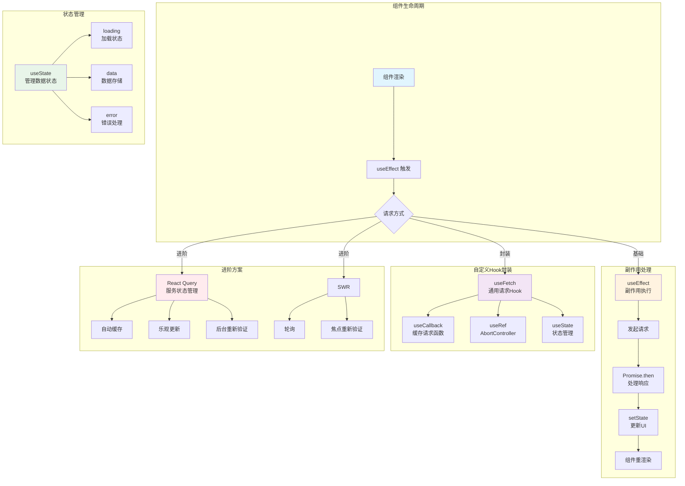
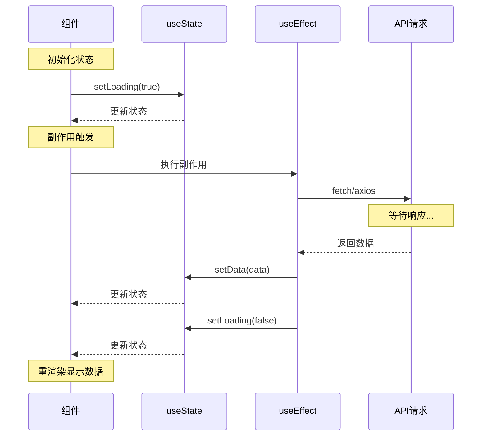

# React 与后台 API 接口交互

## 0x01 概述

React 与后台 API 交互是前端开发的核心能力。本文档涵盖从基础到进阶的 API 交互方式，包括原生 fetch、axios、React Query/SWR 等方案。

### React API 交互核心功能点



### 核心 Hook 关系



### 数据流说明

| 阶段 | 使用的 Hook | 作用 |
|------|-------------|------|
| **状态初始化** | `useState` | 存储 loading、data、error 状态 |
| **请求触发** | `useEffect` | 组件挂载时发起请求 |
| **请求取消** | `useRef` + `AbortController` | 组件卸载时取消请求 |
| **函数缓存** | `useCallback` | 缓存请求函数，避免重创建 |
| **数据缓存** | `React Query/SWR` | 缓存和重新验证数据 |

## 0x02 使用 fetch

### 基本 GET 请求

```tsx
import { useState, useEffect } from 'react';

interface User {
  id: number;
  name: string;
  email: string;
}

function UserList() {
  const [users, setUsers] = useState<User[]>([]);
  const [loading, setLoading] = useState(true);
  const [error, setError] = useState<string | null>(null);

  useEffect(() => {
    fetch('https://api.example.com/users')
      .then(res => {
        if (!res.ok) {
          throw new Error(`HTTP error! status: ${res.status}`);
        }
        return res.json();
      })
      .then(data => {
        setUsers(data);
        setLoading(false);
      })
      .catch(err => {
        setError(err.message);
        setLoading(false);
      });
  }, []);

  if (loading) return <p>Loading...</p>;
  if (error) return <p>Error: {error}</p>;

  return (
    <ul>
      {users.map(user => (
        <li key={user.id}>{user.name} - {user.email}</li>
      ))}
    </ul>
  );
}
```

### POST 请求

```tsx
import { useState } from 'react';

function CreateUser() {
  const [formData, setFormData] = useState({
    name: '',
    email: ''
  });
  const [status, setStatus] = useState<'idle' | 'loading' | 'success' | 'error'>('idle');

  const handleSubmit = async (e: React.FormEvent) => {
    e.preventDefault();
    setStatus('loading');

    try {
      const response = await fetch('https://api.example.com/users', {
        method: 'POST',
        headers: {
          'Content-Type': 'application/json',
          'Authorization': `Bearer ${localStorage.getItem('token')}`
        },
        body: JSON.stringify(formData)
      });

      if (!response.ok) {
        throw new Error('Failed to create user');
      }

      const data = await response.json();
      console.log('Created user:', data);
      setStatus('success');
      setFormData({ name: '', email: '' });
    } catch (error) {
      console.error('Error:', error);
      setStatus('error');
    }
  };

  return (
    <form onSubmit={handleSubmit}>
      <input
        value={formData.name}
        onChange={e => setFormData({ ...formData, name: e.target.value })}
        placeholder="Name"
      />
      <input
        value={formData.email}
        onChange={e => setFormData({ ...formData, email: e.target.value })}
        placeholder="Email"
      />
      <button type="submit" disabled={status === 'loading'}>
        {status === 'loading' ? 'Creating...' : 'Create'}
      </button>
      {status === 'success' && <p>User created successfully!</p>}
      {status === 'error' && <p>Failed to create user</p>}
    </form>
  );
}
```

### 请求超时处理

```tsx
import { useState, useEffect } from 'react';

function fetchWithTimeout(
  url: string,
  options: RequestInit = {},
  timeout = 5000
): Promise<Response> {
  const controller = new AbortController();
  const timeoutId = setTimeout(() => controller.abort(), timeout);

  return fetch(url, {
    ...options,
    signal: controller.signal
  }).finally(() => clearTimeout(timeoutId));
}

function DataFetcher() {
  const [data, setData] = useState(null);
  const [error, setError] = useState<string | null>(null);

  useEffect(() => {
    fetchWithTimeout('https://api.example.com/data', {}, 3000)
      .then(res => res.json())
      .then(setData)
      .catch(err => {
        if (err.name === 'AbortError') {
          setError('Request timeout');
        } else {
          setError(err.message);
        }
      });
  }, []);

  return <div>{data ? JSON.stringify(data) : error || 'Loading...'}</div>;
}
```

## 0x03 使用 axios

### axios 实例配置

```tsx
import axios from 'axios';

// 创建 axios 实例
const api = axios.create({
  baseURL: 'https://api.example.com',
  timeout: 10000,
  headers: {
    'Content-Type': 'application/json'
  }
});

// 请求拦截器 - 添加 Token
api.interceptors.request.use(
  config => {
    const token = localStorage.getItem('token');
    if (token) {
      config.headers.Authorization = `Bearer ${token}`;
    }
    return config;
  },
  error => Promise.reject(error)
);

// 响应拦截器 - 统一错误处理
api.interceptors.response.use(
  response => response,
  error => {
    if (error.response?.status === 401) {
      // Token 过期，清除并跳转登录
      localStorage.removeItem('token');
      window.location.href = '/login';
    }
    return Promise.reject(error);
  }
);

export default api;
```

### 封装 API 服务

```tsx
import api from './api';

// 用户相关 API
export const userApi = {
  // 获取用户列表
  getList: (params?: { page?: number; limit?: number }) =>
    api.get('/users', { params }),

  // 获取单个用户
  getById: (id: number) =>
    api.get(`/users/${id}`),

  // 创建用户
  create: (data: { name: string; email: string }) =>
    api.post('/users', data),

  // 更新用户
  update: (id: number, data: Partial<{ name: string; email: string }>) =>
    api.put(`/users/${id}`, data),

  // 删除用户
  delete: (id: number) =>
    api.delete(`/users/${id}`)
};

// 商品相关 API
export const productApi = {
  list: (params?: { category?: string; page?: number }) =>
    api.get('/products', { params }),

  detail: (id: number) =>
    api.get(`/products/${id}`),

  create: (data: FormData) =>
    api.post('/products', data, {
      headers: { 'Content-Type': 'multipart/form-data' }
    })
};
```

### 在组件中使用

```tsx
import { useState, useEffect } from 'react';
import { userApi } from './api/services';

function UserList() {
  const [users, setUsers] = useState<any[]>([]);
  const [loading, setLoading] = useState(true);
  const [error, setError] = useState<string | null>(null);

  useEffect(() => {
    userApi.getList({ page: 1, limit: 10 })
      .then(res => {
        setUsers(res.data);
        setLoading(false);
      })
      .catch(err => {
        setError(err.message);
        setLoading(false);
      });
  }, []);

  if (loading) return <div>Loading...</div>;
  if (error) return <div>Error: {error}</div>;

  return (
    <ul>
      {users.map(user => (
        <li key={user.id}>{user.name}</li>
      ))}
    </ul>
  );
}

function CreateUser() {
  const [name, setName] = useState('');
  const [email, setEmail] = useState('');

  const handleSubmit = async (e: React.FormEvent) => {
    e.preventDefault();
    try {
      await userApi.create({ name, email });
      alert('User created!');
      setName('');
      setEmail('');
    } catch (error) {
      alert('Failed to create user');
    }
  };

  return (
    <form onSubmit={handleSubmit}>
      <input value={name} onChange={e => setName(e.target.value)} />
      <input value={email} onChange={e => setEmail(e.target.value)} />
      <button type="submit">Create</button>
    </form>
  );
}
```

## 0x04 使用 React Query

React Query 是目前推荐的服务器状态管理方案。

### 基本配置

```tsx
import { QueryClient, QueryClientProvider } from '@tanstack/react-query';

const queryClient = new QueryClient({
  defaultOptions: {
    queries: {
      staleTime: 5 * 60 * 1000, // 5分钟内数据视为新鲜
      cacheTime: 30 * 60 * 1000, // 缓存30分钟
      retry: 3,
      refetchOnWindowFocus: false
    }
  }
});

function App() {
  return (
    <QueryClientProvider client={queryClient}>
      <YourApp />
    </QueryClientProvider>
  );
}
```

### 查询数据

```tsx
import { useQuery } from '@tanstack/react-query';

interface User {
  id: number;
  name: string;
  email: string;
}

function UserList() {
  const { 
    data, 
    isLoading, 
    isError, 
    error,
    refetch 
  } = useQuery({
    queryKey: ['users'],
    queryFn: async () => {
      const res = await fetch('https://api.example.com/users');
      if (!res.ok) throw new Error('Network response was not ok');
      return res.json();
    }
  });

  if (isLoading) return <div>Loading...</div>;
  if (isError) return <div>Error: {error?.message}</div>;

  return (
    <div>
      <button onClick={() => refetch()}>Refresh</button>
      <ul>
        {data?.map((user: User) => (
          <li key={user.id}>{user.name} - {user.email}</li>
        ))}
      </ul>
    </div>
  );
}
```

### 带参数查询

```tsx
function UserDetail({ userId }: { userId: number }) {
  const { data, isLoading, isError } = useQuery({
    queryKey: ['user', userId],
    queryFn: async () => {
      const res = await fetch(`https://api.example.com/users/${userId}`);
      return res.json();
    },
    enabled: !!userId // 只有 userId 存在时才执行
  });

  if (isLoading) return <div>Loading...</div>;
  if (isError) return <div>Error loading user</div>;

  return (
    <div>
      <h2>{data.name}</h2>
      <p>{data.email}</p>
    </div>
  );
}

function UserListPage() {
  const [selectedId, setSelectedId] = useState<number | null>(null);

  return (
    <div>
      <UserList onSelect={setSelectedId} />
      {selectedId && <UserDetail userId={selectedId} />}
    </div>
  );
}
```

###  mutations（增删改）

```tsx
import { useMutation, useQueryClient } from '@tanstack/react-query';

function CreateUser() {
  const queryClient = useQueryClient();
  const [name, setName] = useState('');
  const [email, setEmail] = useState('');

  const mutation = useMutation({
    mutationFn: (newUser: { name: string; email: string }) =>
      fetch('https://api.example.com/users', {
        method: 'POST',
        headers: { 'Content-Type': 'application/json' },
        body: JSON.stringify(newUser)
      }).then(res => res.json()),
    
    // 成功后刷新列表
    onSuccess: () => {
      queryClient.invalidateQueries({ queryKey: ['users'] });
      setName('');
      setEmail('');
    }
  });

  const handleSubmit = (e: React.FormEvent) => {
    e.preventDefault();
    mutation.mutate({ name, email });
  };

  return (
    <form onSubmit={handleSubmit}>
      <input value={name} onChange={e => setName(e.target.value)} />
      <input value={email} onChange={e => setEmail(e.target.value)} />
      <button 
        type="submit" 
        disabled={mutation.isPending}
      >
        {mutation.isPending ? 'Creating...' : 'Create'}
      </button>
      {mutation.isError && <p>Error creating user</p>}
      {mutation.isSuccess && <p>User created!</p>}
    </form>
  );
}

function DeleteUser({ userId }: { userId: number }) {
  const queryClient = useQueryClient();

  const mutation = useMutation({
    mutationFn: () =>
      fetch(`https://api.example.com/users/${userId}`, {
        method: 'DELETE'
      }),
    onSuccess: () => {
      queryClient.invalidateQueries({ queryKey: ['users'] });
    }
  });

  return (
    <button 
      onClick={() => mutation.mutate()}
      disabled={mutation.isPending}
    >
      {mutation.isPending ? 'Deleting...' : 'Delete'}
    </button>
  );
}
```

### 乐观更新

```tsx
import { useMutation, useQueryClient } from '@tanstack/react-query';

function UpdateUser({ user }: { user: User }) {
  const queryClient = useQueryClient();

  const mutation = useMutation({
    mutationFn: (updatedUser: User) =>
      fetch(`https://api.example.com/users/${user.id}`, {
        method: 'PUT',
        headers: { 'Content-Type': 'application/json' },
        body: JSON.stringify(updatedUser)
      }).then(res => res.json()),

    // 乐观更新：先更新缓存，失败则回滚
    onMutate: async (newUser: User) => {
      // 取消正在进行的查询
      await queryClient.cancelQueries({ queryKey: ['users'] });

      // 保存之前的值
      const previousUsers = queryClient.getQueryData(['users']);

      // 立即更新缓存
      queryClient.setQueryData(['users'], (old: User[] | undefined) =>
        old?.map(u => u.id === newUser.id ? newUser : u)
      );

      return { previousUsers };
    },
    onError: (err, newUser, context) => {
      // 失败回滚
      queryClient.setQueryData(['users'], context?.previousUsers);
    },
    onSettled: () => {
      // 无论成功失败都重新获取
      queryClient.invalidateQueries({ queryKey: ['users'] });
    }
  });

  return (
    <button onClick={() => mutation.mutate({ ...user, name: 'Updated' })}>
      Update
    </button>
  );
}
```

## 0x05 使用 SWR

SWR 是 Vercel 推出的轻量级数据获取库。

### 基本用法

```tsx
import useSWR from 'swr';

const fetcher = (url: string) => 
  fetch(url).then(res => res.json());

function UserList() {
  const { data, error, isLoading, mutate } = useSWR('/api/users', fetcher);

  if (error) return <div>Failed to load</div>;
  if (isLoading) return <div>Loading...</div>;

  return (
    <div>
      <button onClick={() => mutate()}>Refresh</button>
      <ul>
        {data?.map((user: User) => (
          <li key={user.id}>{user.name}</li>
        ))}
      </ul>
    </div>
  );
}
```

### 高级配置

```tsx
function AdvancedSWR() {
  const { data, isLoading } = useSWR('/api/data', fetcher, {
    refreshInterval: 5000, // 每5秒轮询
    revalidateOnFocus: true, // 窗口聚焦时重新验证
    revalidateOnReconnect: true, // 重连时重新验证
    dedupingInterval: 2000, // 2秒内不重复请求
    shouldRetryOnError: true, // 错误重试
    errorRetryInterval: 5000 // 错误重试间隔
  });

  return <div>{data ? JSON.stringify(data) : 'Loading...'}</div>;
}
```

## 0x06 自定义 Hook 封装

### 通用数据获取 Hook

```tsx
import { useState, useEffect, useCallback } from 'react';

interface UseFetchOptions<T> {
  url: string;
  method?: 'GET' | 'POST' | 'PUT' | 'DELETE';
  body?: any;
  headers?: Record<string, string>;
}

interface UseFetchResult<T> {
  data: T | null;
  loading: boolean;
  error: string | null;
  refetch: () => Promise<void>;
}

function useFetch<T>(options: UseFetchOptions<T>): UseFetchResult<T> {
  const [data, setData] = useState<T | null>(null);
  const [loading, setLoading] = useState(true);
  const [error, setError] = useState<string | null>(null);

  const fetchData = useCallback(async () => {
    setLoading(true);
    setError(null);

    try {
      const res = await fetch(options.url, {
        method: options.method || 'GET',
        headers: {
          'Content-Type': 'application/json',
          ...options.headers
        },
        body: options.body ? JSON.stringify(options.body) : undefined
      });

      if (!res.ok) {
        throw new Error(`Error: ${res.status}`);
      }

      const result = await res.json();
      setData(result);
    } catch (err: any) {
      setError(err.message);
    } finally {
      setLoading(false);
    }
  }, [options.url, options.method, options.body, options.headers]);

  useEffect(() => {
    if (options.method === 'GET' || !options.method) {
      fetchData();
    }
  }, [fetchData, options.method]);

  return { data, loading, error, refetch: fetchData };
}

// 使用
function UserList() {
  const { data, loading, error, refetch } = useFetch<User[]>({
    url: 'https://api.example.com/users'
  });

  if (loading) return <div>Loading...</div>;
  if (error) return <div>Error: {error}</div>;

  return (
    <div>
      <button onClick={refetch}>Refresh</button>
      <ul>
        {data?.map(user => (
          <li key={user.id}>{user.name}</li>
        ))}
      </ul>
    </div>
  );
}
```

### 带认证的 Hook

```tsx
import { useState, useEffect, useCallback } from 'react';

function useAuthFetch<T>(url: string, options?: RequestInit) {
  const [data, setData] = useState<T | null>(null);
  const [loading, setLoading] = useState(true);
  const [error, setError] = useState<string | null>(null);

  const fetchData = useCallback(async () => {
    setLoading(true);
    setError(null);

    try {
      const token = localStorage.getItem('token');
      const headers: HeadersInit = {
        ...options?.headers,
        ...(token ? { Authorization: `Bearer ${token}` } : {})
      };

      const res = await fetch(url, { ...options, headers });

      if (res.status === 401) {
        localStorage.removeItem('token');
        window.location.href = '/login';
        throw new Error('Unauthorized');
      }

      if (!res.ok) {
        throw new Error(`Error: ${res.status}`);
      }

      const result = await res.json();
      setData(result);
    } catch (err: any) {
      setError(err.message);
    } finally {
      setLoading(false);
    }
  }, [url, options]);

  useEffect(() => {
    fetchData();
  }, [fetchData]);

  return { data, loading, error, refetch: fetchData };
}

// 使用
function Dashboard() {
  const { data, loading, error } = useAuthFetch('/api/dashboard');
  
  if (loading) return <div>Loading...</div>;
  if (error) return <div>Error: {error}</div>;

  return <div>{JSON.stringify(data)}</div>;
}
```

### 表单提交 Hook

```tsx
import { useState, useCallback } from 'react';

interface SubmitOptions<T> {
  url: string;
  method?: 'POST' | 'PUT' | 'PATCH';
  onSuccess?: (data: T) => void;
  onError?: (error: string) => void;
}

interface SubmitState {
  loading: boolean;
  error: string | null;
  data: any | null;
}

function useSubmit<T>(options: SubmitOptions<T>) {
  const [state, setState] = useState<SubmitState>({
    loading: false,
    error: null,
    data: null
  });

  const submit = useCallback(async (body: any) => {
    setState(prev => ({ ...prev, loading: true, error: null }));

    try {
      const token = localStorage.getItem('token');
      const res = await fetch(options.url, {
        method: options.method || 'POST',
        headers: {
          'Content-Type': 'application/json',
          ...(token ? { Authorization: `Bearer ${token}` } : {})
        },
        body: JSON.stringify(body)
      });

      if (!res.ok) {
        throw new Error(`Error: ${res.status}`);
      }

      const data = await res.json();
      setState({ loading: false, error: null, data });
      options.onSuccess?.(data);
      return data;
    } catch (err: any) {
      const errorMessage = err.message || 'Submission failed';
      setState({ loading: false, error: errorMessage, data: null });
      options.onError?.(errorMessage);
    }
  }, [options]);

  return {
    ...state,
    submit,
    reset: () => setState({ loading: false, error: null, data: null })
  };
}

// 使用
function LoginForm() {
  const [form, setForm] = useState({ email: '', password: '' });

  const { loading, error, submit } = useSubmit({
    url: 'https://api.example.com/login',
    method: 'POST',
    onSuccess: (data) => {
      localStorage.setItem('token', data.token);
      window.location.href = '/dashboard';
    }
  });

  const handleSubmit = async (e: React.FormEvent) => {
    e.preventDefault();
    await submit(form);
  };

  return (
    <form onSubmit={handleSubmit}>
      <input
        type="email"
        value={form.email}
        onChange={e => setForm({ ...form, email: e.target.value })}
      />
      <input
        type="password"
        value={form.password}
        onChange={e => setForm({ ...form, password: e.target.value })}
      />
      <button type="submit" disabled={loading}>
        {loading ? 'Logging in...' : 'Login'}
      </button>
      {error && <p className="error">{error}</p>}
    </form>
  );
}
```

## 0x07 请求取消

### AbortController

```tsx
import { useState, useEffect, useRef } from 'react';

function SearchResults({ query }: { query: string }) {
  const [results, setResults] = useState<any[]>([]);
  const abortControllerRef = useRef<AbortController>();

  useEffect(() => {
    // 取消之前的请求
    abortControllerRef.current?.abort();

    if (!query) {
      setResults([]);
      return;
    }

    const controller = new AbortController();
    abortControllerRef.current = controller;

    fetch(`/api/search?q=${query}`, { signal: controller.signal })
      .then(res => res.json())
      .then(data => setResults(data))
      .catch(err => {
        if (err.name !== 'AbortError') {
          console.error(err);
        }
      });

    return () => controller.abort();
  }, [query]);

  return (
    <ul>
      {results.map(r => <li key={r.id}>{r.title}</li>)}
    </ul>
  );
}
```

### React Query 取消

```tsx
import { useQuery, useEffect } from '@tanstack/react-query';

function AutoSearch({ query }: { query: string }) {
  const { data, isLoading } = useQuery({
    queryKey: ['search', query],
    queryFn: async ({ signal }) => {
      const res = await fetch(`/api/search?q=${query}`, { signal });
      return res.json();
    },
    enabled: query.length > 0, // 只有有内容时才搜索
    staleTime: 0 // 立即标记为过时
  });

  return <div>{isLoading ? 'Searching...' : JSON.stringify(data)}</div>;
}
```

## 0x08 文件上传

```tsx
import { useState } from 'react';
import { useMutation } from '@tanstack/react-query';

function FileUploader() {
  const [file, setFile] = useState<File | null>(null);
  const [progress, setProgress] = useState(0);

  const uploadMutation = useMutation({
    mutationFn: async (file: File) => {
      const formData = new FormData();
      formData.append('file', file);

      const xhr = new XMLHttpRequest();
      
      return new Promise((resolve, reject) => {
        xhr.upload.addEventListener('progress', (e) => {
          if (e.lengthComputable) {
            setProgress(Math.round((e.loaded / e.total) * 100));
          }
        });

        xhr.addEventListener('load', () => {
          if (xhr.status >= 200 && xhr.status < 300) {
            resolve(JSON.parse(xhr.responseText));
          } else {
            reject(new Error('Upload failed'));
          }
        });

        xhr.addEventListener('error', reject);

        xhr.open('POST', 'https://api.example.com/upload');
        const token = localStorage.getItem('token');
        if (token) {
          xhr.setRequestHeader('Authorization', `Bearer ${token}`);
        }
        xhr.send(formData);
      });
    }
  });

  const handleFileChange = (e: React.ChangeEvent<HTMLInputElement>) => {
    const selectedFile = e.target.files?.[0];
    if (selectedFile) {
      setFile(selectedFile);
      uploadMutation.mutate(selectedFile);
    }
  };

  return (
    <div>
      <input type="file" onChange={handleFileChange} />
      {uploadMutation.isPending && (
        <progress value={progress} max="100">{progress}%</progress>
      )}
      {uploadMutation.isSuccess && <p>Upload complete!</p>}
      {uploadMutation.isError && <p>Upload failed</p>}
    </div>
  );
}
```

## 0x09 错误边界处理

```tsx
import { Component, ReactNode } from 'react';

interface Props {
  children: ReactNode;
  fallback?: ReactNode;
}

interface State {
  hasError: boolean;
  error: Error | null;
}

class ErrorBoundary extends Component<Props, State> {
  state: State = { hasError: false, error: null };

  static getDerivedStateFromError(error: Error): State {
    return { hasError: true, error };
  }

  componentDidCatch(error: Error, errorInfo: React.ErrorInfo) {
    console.error('Error:', error, errorInfo);
    // 可以在这里上报错误到服务器
    // errorTracker.captureException(error);
  }

  render() {
    if (this.state.hasError) {
      return this.props.fallback || (
        <div>
          <h2>Something went wrong</h2>
          <p>{this.state.error?.message}</p>
          <button onClick={() => this.setState({ hasError: false, error: null })}>
            Try again
          </button>
        </div>
      );
    }

    return this.props.children;
  }
}

// 使用
function App() {
  return (
    <ErrorBoundary>
      <UserList />
    </ErrorBoundary>
  );
}
```

## 0x10 最佳实践

### API 分层

```tsx
// api/client.ts - axios 实例
import axios from 'axios';

const apiClient = axios.create({
  baseURL: '/api',
  timeout: 10000
});

apiClient.interceptors.response.use(
  response => response,
  error => {
    if (error.response?.status === 401) {
      // 处理未授权
    }
    return Promise.reject(error);
  }
);

export default apiClient;

// api/endpoints.ts - API 端点
import apiClient from './client';

export const userApi = {
  list: (params: any) => apiClient.get('/users', { params }),
  get: (id: number) => apiClient.get(`/users/${id}`),
  create: (data: any) => apiClient.post('/users', data),
  update: (id: number, data: any) => apiClient.put(`/users/${id}`, data),
  delete: (id: number) => apiClient.delete(`/users/${id}`)
};

export const productApi = {
  list: (params: any) => apiClient.get('/products', { params }),
  get: (id: number) => apiClient.get(`/products/${id}`)
};

// hooks/useUsers.ts - 业务 Hook
import { useQuery, useMutation, useQueryClient } from '@tanstack/react-query';
import { userApi } from '@/api/endpoints';

export function useUsers(params?: any) {
  return useQuery({
    queryKey: ['users', params],
    queryFn: () => userApi.list(params)
  });
}

export function useCreateUser() {
  const queryClient = useQueryClient();
  
  return useMutation({
    mutationFn: userApi.create,
    onSuccess: () => {
      queryClient.invalidateQueries({ queryKey: ['users'] });
    }
  });
}

// components/UserList.tsx - 组件
import { useUsers, useCreateUser } from '@/hooks/useUsers';

function UserList() {
  const { data, isLoading } = useUsers({ page: 1 });
  const createUser = useCreateUser();

  // ...
}
```

### 环境变量配置

```bash
# .env
VITE_API_BASE_URL=https://api.example.com
VITE_API_TIMEOUT=10000
```

```tsx
// config.ts
export const config = {
  baseURL: import.meta.env.VITE_API_BASE_URL || '/api',
  timeout: Number(import.meta.env.VITE_API_TIMEOUT) || 10000
};
```

## 参考

- [MDN Fetch API](https://developer.mozilla.org/en-US/docs/Web/API/Fetch_API)
- [axios 文档](https://axios-http.com)
- [React Query](https://tanstack.com/query/latest)
- [SWR](https://swr.vercel.sh)
